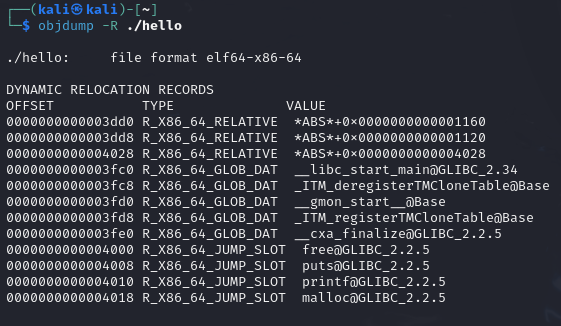
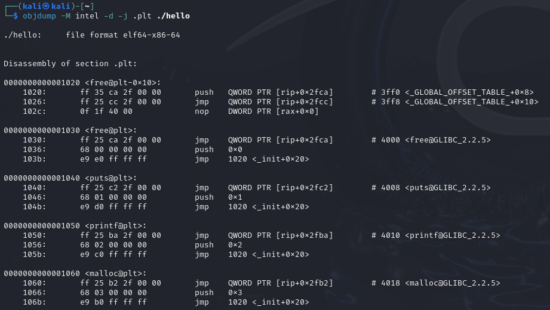
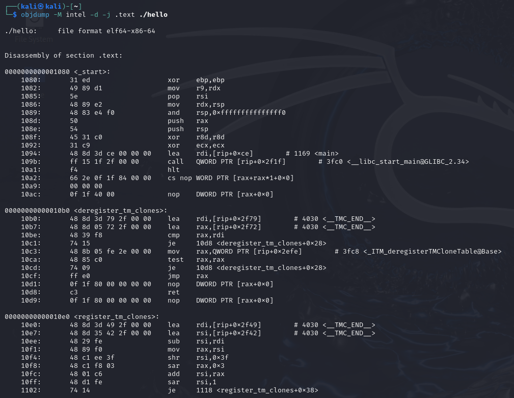
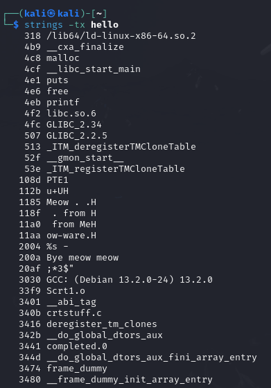
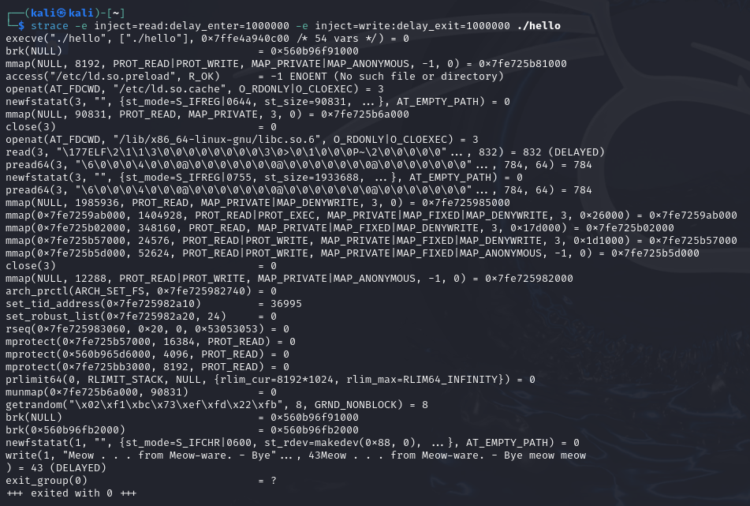
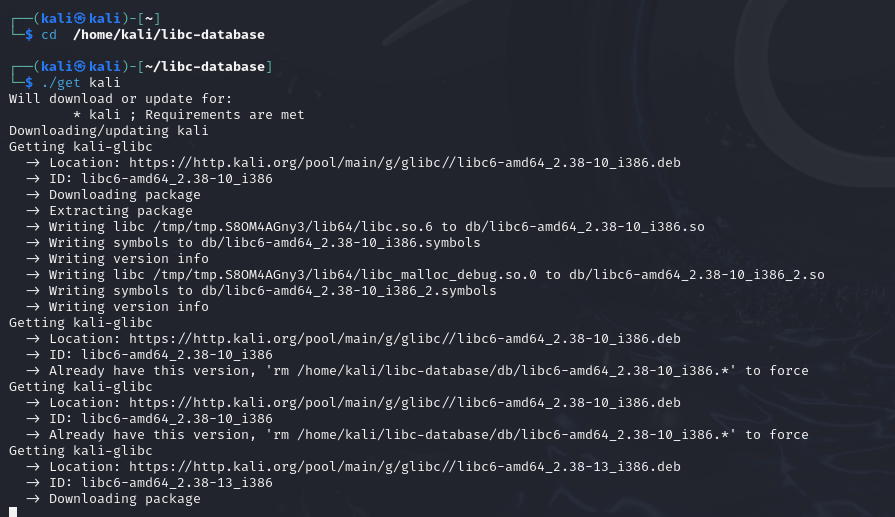
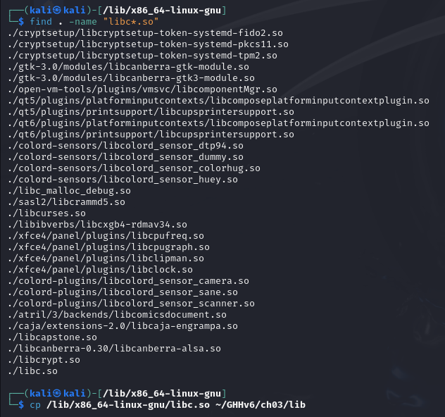
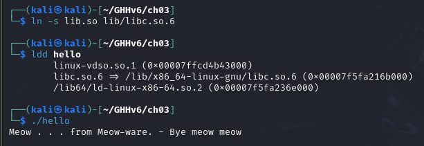

# Compile `hello.c`

```bash
gcc hello.c -o hello && ./hello
```
 <br>

# ldd
The ldd tool displays the shared libraries loaded by programs at runtime.  <br>
 <br>

# Objdump

You can use the objdump command-line tool not only as a disassembler but also to retrieve important information about executable files and object files. <br>

- Getting the **Global Offset Table (GOT)** and Procedure Linkage Table (PLT)
- With the `-R` option, you can display the list of functions in the **GOT**
 <br>

```bash
objdump -M intel -d -j .plt ./hello
```


- The `-M` intel option instructs objdump to use Intel syntax mode instead of the default AT&T syntax.
- The `-d` option is a shorthand for `--disassemble`.
- The `-j .plt` option specifies that we want to display the `.plt` section. <br>

```bash
objdump -M intel -d -j .text ./hello
```

 <br>

```bash
strings -tx hello | grep "meow"
```
The `-tx` option, where `-t` stands for radix and `x` specifies hexadecimal, prints the offset within the file at the beginning of each string in hexadecimal format. <br>
 <br>
 <br>

# `strace`
```bash
strace ./hello
```
The `strace` command-line utility is a valuable tool for tracing system calls and signals. It leverages the `ptrace` system call to inspect and manipulate the target program, enabling a deeper understanding of the program’s behavior. <br>

Beyond analysis, `strace` can also be used to alter system call behavior, aiding in troubleshooting or facilitating the reproduction of attacks in specific scenarios, such as fault injection, return value manipulation, signal injection, and delay injection. <br>

 <br>

You can use the `-e trace=syscall` option to trace or filter a specific system call, as demonstrated below: <br>


```bash
strace -e trace=write -e fault=write ./hello 
strace -e trace=write -e fault=write:error=EAGAIN ./hello
```




```bash
strace -e inject=read:delay_enter=1000000 -e inject=write:delay_exit=1000000 ./hello
```
 <br>

# `ltrace`
The primary function of the `ltrace` utility is to trace calls to shared libraries and their responses. However, it can also be used to trace system calls. Since `ltrace` is not included with Kali by default, you should check if it's installed by running the `dpkg -l ltrace` command. If it's not installed, you can install it using` sudo apt install ltrace`. <br>
```bash
ltarce .\hello
```
 <br>

```bash
gcc hello.c -Wl,-z,relro,-z,now -O2 -D_FORTIFY_SOURCE=2 -s -fstack-protector-all -o hello-stronger
```


# `checksum`
```bash
checksec --file=./hello-stronger 
```
 <br>

# libc-database

```bash
git clone https://github.com/niklasb/libc-database.git
```
 <br>

```bash
cd  /home/kali/libc-database
```
 <br>
```bash
readelf -s /lib/x86_64-linux-gnu/libc.so.6 | grep puts
./find puts 77640
```
 <br>
 <br>

# patchchelf

```bash
sudo apt install patchelf
mkdir GHHv6/ch03 && cd /home/kali/GHHv6/ch03 && mkdir lib && cp /lib64/ld-linux-x86-64.so.2 lib/ld.so
```


```bash
find . -type f -name "libc*.so"
cp /home/kali/libc-database/db/libc6-x32_2.38-10_i386_2.so lib
ln -s lib.so lib/libc.so.6

```
 <br>
 <br>
 <br>

The `patchelf` command-line utility enables us to modify the libraries used by an `ELF` executable. This tool is particularly useful when conducting heap analysis on a different libc version than the one used by the remote system or when running multiple `libc` versions on the same system without access to the source code. You can obtain `patchelf` from its GitHub repository or install it easily using sudo apt install `patchelf`. <br>

In this lab, I'll use` patchelf` to modify the hello binary to utilize an interpreter and a specific `libc` version that have been copied to the `/home/kali/GHHv6/ch03/lib` directory. <br>
```bash
patchelf --set-interpreter ./lib/my-ld.so --set-rpath ./lib hello
ln -s libc.so lib/libc.so.6
ldd hello
```


 <br>
 <br>

 <br>
 <br>


---

# References
- [Gray Hat Hacking: The Ethical Hacker's Handbook, Sixth Edition, 6th Edition](https://www.oreilly.com/library/view/gray-hat-hacking/9781264268955/) By Allen Harper, Ryan Linn, Stephen Sims, Michael Baucom, Huascar Tejeda, Daniel Fernandez, Moses Frost, 2022.

