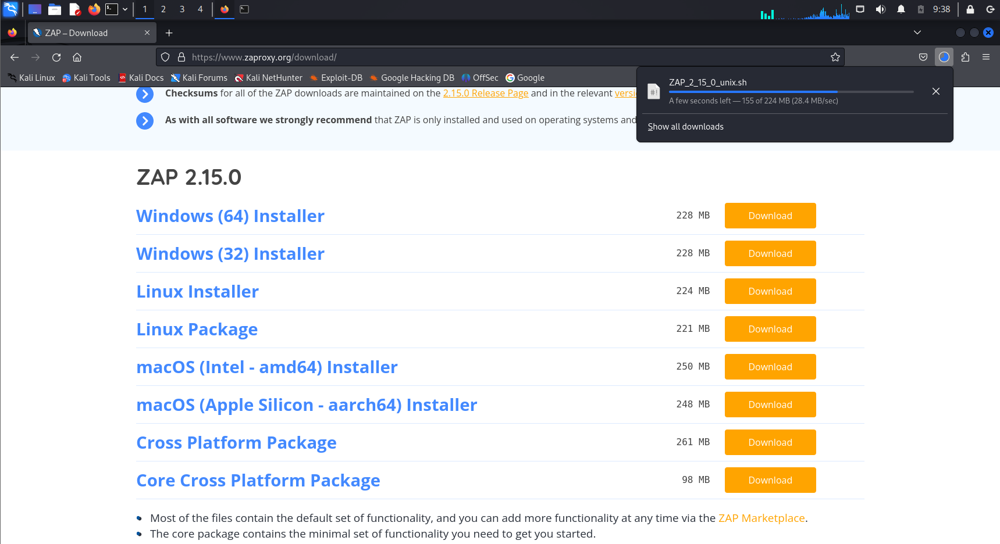
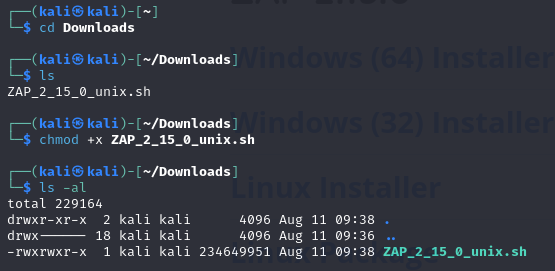
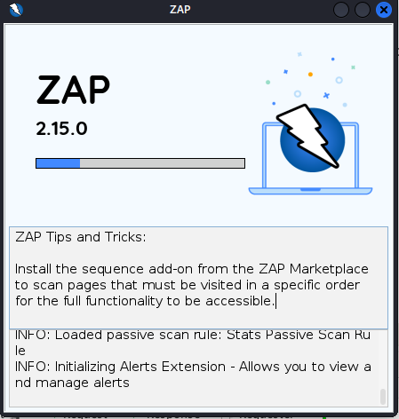
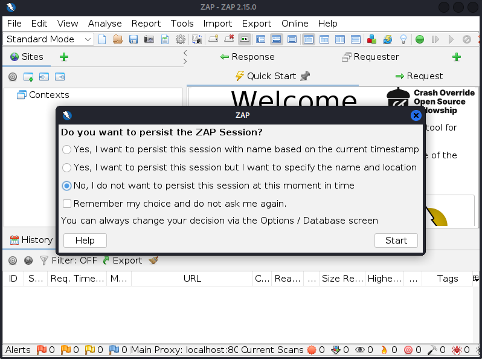
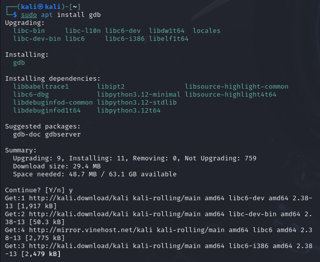

# What's needed
- Kali VM
- [ZAP](https://www.zaproxy.org/getting-started/)
- dgb

# Installation of `ZAP`
Visit [ZAP Download page](https://www.zaproxy.org/download/), download Linux Installer. <br>


Go the `Downloads` folder, and prepare for exxcution. <br>
```bash
cd Downloads
ls
chmod +x ZAP_2_15_0_unix.sh 
ls -al
```


Then start the installation. <br>


Just choose standard Installtion. <br>


Now you can find `ZAP` in the menu in Kali. <br>


# Explore ZAP
Up and running. <br>



UI looks like this: <br>


---

# gdb
```bash
sudo apt install gdb
```


---

# References
- [ZAP - Getting Satrted](https://www.zaproxy.org/getting-started/)